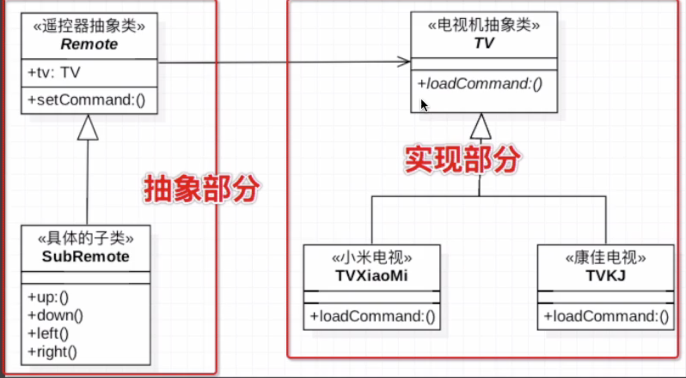
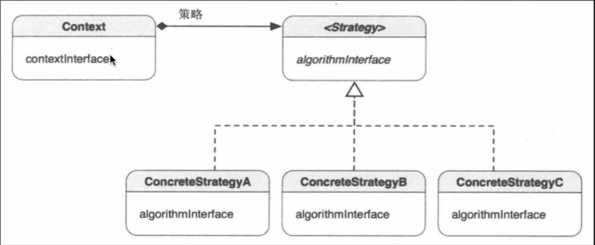

# 一、设计模式概念
    概念：未解决特定场景下的问题制定的方案。
# 二、设计模式的基本原则
    1.开闭原则 (Open Closed Principle, OCP) 
    2.里氏代换原则 (Liskov Substitution Principle , LSP)
    3.依赖倒转原则 (Dependency Inversion Principle, DIP) 
    4.接口隔离原则 (Interface Segregation Principle, ISP)
    5.合成/聚合复用原则 (Composite/ Aggregate Reuse Principle, CARP)
    6.最小知识原则 (Principle of Least Knowledge, PLK)
    7.单一职责原则 (Single responsibility principle, SRP)

# 设计模式

* MVC 面向对象设计模式
* MVP 面向接口设计模式
* MVVM 响应式编程

定义：
原理：
例子：

1. 桥接模式
>     定义：将抽象部分与它的实现部分分离，使他们都可以独立的变化。
>     原理：抽象层与实现层分离，抽象定义了供客户端调用的接口抽象，实现层提供了具体的逻辑。实现类的引用被封装到抽象层的实例中，桥接就形成。
>     例子：思路: 把遥控器抽象出一个父类, 把电视机也抽象出一个父类。用抽象的遥控器对抽象电视机类进行引用,具体的实现由他们的子类来做。（不同的遥控器和不同的电视）

    
2. 工厂模式（简单工厂、工厂方法、 抽象工厂）
>     定义：创建空的对象。在工厂方法里面进行水果的制造。
>     原理：
>     例子：
    
3. 享元模式
>     定义：
>     原理：
>     例子：

4. 策略模式
>     同样的效果，不一样的显示策略
>     淘宝的列表显示跟宫格显示, 登录实现

