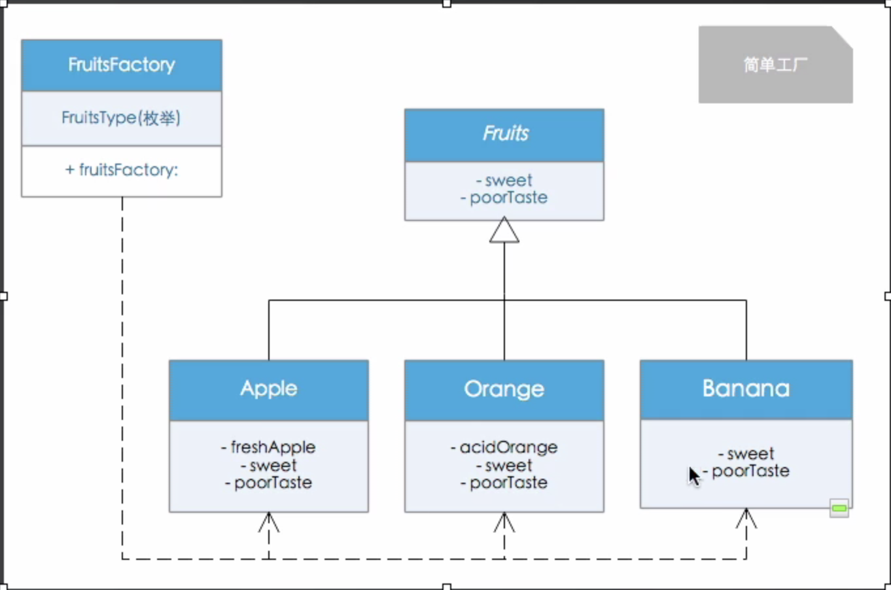

# 一、设计模式概念
    概念：未解决特定场景下的问题制定的方案。
# 二、设计模式的基本原则
    1.开闭原则 (Open Closed Principle, OCP) 
    2.里氏代换原则 (Liskov Substitution Principle , LSP)
    3.依赖倒转原则 (Dependency Inversion Principle, DIP) 
    4.接口隔离原则 (Interface Segregation Principle, ISP)
    5.合成/聚合复用原则 (Composite/ Aggregate Reuse Principle, CARP)
    6.最小知识原则 (Principle of Least Knowledge, PLK)
    7.单一职责原则 (Single responsibility principle, SRP)

# 设计模式

* MVC 面向对象设计模式
* MVP 面向接口设计模式
* MVVM 响应式编程

1. 桥接模式
>     定义：将抽象部分与它的实现部分分离，使他们都可以独立的变化。
>     原理：抽象层与实现层分离，抽象定义了供客户端调用的接口抽象，实现层提供了具体的逻辑。实现类的引用被封装到抽象层的实例中，桥接就形成。
>     例子：思路: 把遥控器抽象出一个父类, 把电视机也抽象出一个父类。用抽象的遥控器对抽象电视机类进行引用,具体的实现由他们的子类来做。（不同的遥控器和不同的电视）

    
2. 简单工厂
>     定义：创建空的对象。在工厂方法里面进行水果的制造。
>     原理：
>     例子：

3. 工厂方法
>     定义：定义创建对象的接口，让子类决定实例化哪一个类，一个类要实例的时候，被延迟到了子类里面进行实现。 
>     原理：
>     例子：

    
4. 抽象工厂
>     定义：
>     原理：
>     例子：

5. 策略模式
>     同样的效果，不一样的显示策略
>     淘宝的列表显示跟宫格显示, 登录实现

6. 享元模式
>     定义：共享相同的数据，可共享的享元对象，享元池（一般配合工厂使用）
>     原理：
>     例子：UItableviewcell， 线程池

7. 适配器模式
>     定义：类适配器：通过集成来适配两个接口。对象适配器：不继承适配者，他们是个关联关系相当于引用这个类
>     原理：
>     例子：UItableview

8. 观察者模式
>     定义：
>     原理：
>     例子：KVO, 消息机制

9. 建造者模式
>     定义：
>     原理：
>     例子：模块化的

10. 中介者模式
>     定义：
>     原理：
>     例子：严格来说MVC属于中介者模式，MVP属于中介者模式

11. 迭代器模式 
>     定义：
>     原理：
>     例子：

12. 组合模式 
>     定义：
>     原理：
>     例子：文件夹,view

13. 责任链模式 
>     定义：避免将一个请求的发送者与接受耦合在一起，让多个对象都有机会处理请求，将接收请求的对象连接成一条链，并沿着这条链传递请求，知道有一个对象能处理它为止。
>     原理：
>     例子：响应者链条

14. 模板模式 
>     定义：
>     原理：
>     例子：

15. 外观模式 
>     定义：为系统中的一组接口提供一个统一的接口，外观定义一个高层接口，让子系统更易于使用
>     原理：
>     例子：

16. 命令模式 
>     定义：提供一种封装方法调用细节的机制，给予这种机制我们可以实现延迟方法调用或者替换方法的组件。
>     原理：
>     例子：

17. 装饰模式 
>     定义：动态的给一个对象添加一些额外的职责，就拓展功能来说，装饰模式比生成子类更为灵活
>     原理：不改变原始类，不改变使用继承，拓展对象功能
>     例子：分类

18. 原型模式 
>     定义：
>     原理：
>     例子：copy

